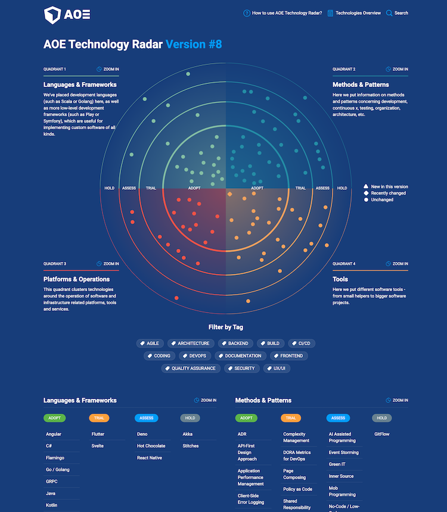

# AOE Technology Radar

A static site generator for AOE Technology Radar



## Looking for the AOE Tech Radar content?

- The repository is now found here: https://github.com/AOEpeople/techradar
- The AOE Tech radar is deployed here: https://www.aoe.com/techradar/index.html

## ✨ Version 4.0.0

Version 4.0.0 is a complete rewrite of the AOE Technology Radar. It is now based
on [Next.js](https://nextjs.org/) to provide enhanced static site generation. The visualization has
been rewritten without the need for the D3 dependency. New features include a fuzzy search based on
Fuse.js, non-overlapping blips on the radar, and a reworked tag filter on the homepage.

To migrate from the old version please migrate your `package.json`'s scripts and create a
new `config.json` based on the documentation below. You can find a reference implementation in
our [repo](https://github.com/AOEpeople/techradar). The old version is still available in the `v3`
branch.

Version 4.0.0 also removes the .html extension from the URLs. If you want to support the old URLs,
we recommend to add a redirect rule. For nginx, you can use the following rule:

```nginx
rewrite ^/techradar/(.+)\.html$ /techradar/$1/ permanent;
```

## Create your own radar

The generator is free to use under Open Source License - in fact there are already some other Radars
published based on our Radar and there are also Contributions back. However, it would be nice to
mention in radar that the generator is based on this repository.

### Step 1: Create a new project

Ensure node.js ist installed and create a new project by creating a new folder with a `package.json`
file like the following and adapt to your needs:

```json
{
  "name": "aoe-techradar",
  "version": "1.0.0",
  "license": "MIT",
  "scripts": {
    "build": "techradar build",
    "serve": "techradar serve"
  },
  "dependencies": {
    "aoe_technology_radar": "^4"
  }
}
```

Run `npm install` to install the dependencies and run `npm run build` to create the initial radar.
This will also create a basic bootstrap of all required files, including the `config.json` and
the `about.md` if they do not exist yet.

### Step 2: Change logo and the favicon

Place your `logo.svg` and `favicon.ico` in the `public` folder next to the `package.json`.
The ideal logo is 150px x 60px. For reference have a look at [public/logo.svg](./public/logo.svg).

### Step 3: Configure the radar

Open the `config.json` file and configure the radar to your needs.

| Attribute | Description                                                                                                                    |
| --------- | ------------------------------------------------------------------------------------------------------------------------------ |
| basePath  | Set if hosting under a sub-path, otherwise set it to `/`. Default is `/techradar`                                              |
| toggles   | (optional) Modify the behaviour and contents of the radar. See config below.                                                   |
| colors    | A map of colors for the radar. Can be any valid CSS color value                                                                |
| quadrants | Config of the 4 quadrants of the radar. See config below.                                                                      |
| rings     | Config of the rings of the radar. See config below.                                                                            |
| flags     | Config of the flags of the radar. See config below                                                                             |
| chart     | If you hava a lot of items, you can increase the `size` to scale down the radar                                                |
| social    | Social links in the footer. See config below                                                                                   |
| imprint   | URL to the legal information                                                                                                   |
| labels    | Configure the labels to change the texts and labels of the radar                                                               |
| tags      | (optional) Use to render only items, which contain at least one of the specified tags. e.g `["frontend", "backend"]`           |
| editUrl   | (optional) If set, an edit button will be shown next to the revision.<br/> You can use placeholders for `{id}` and `{release}` |

#### `config.toggles`

| Attribute        | Description                                             |
| ---------------- | ------------------------------------------------------- |
| showChart        | Render the radar visualization on the homepage?         |
| showTagFilter    | Render the tag filter below the radar?                  |
| showQuadrantList | Render the items below the radar?                       |
| showEmptyRings   | If set to `true` it will render empty rings in the list |

#### `config.quadrants`

| Attribute   | Description                                                 |
| ----------- | ----------------------------------------------------------- |
| id          | Used as reference in the radar markdown files and URLs      |
| title       | Title of the quadrant                                       |
| description | Will be shown on startpage and on the quadrants detail page |
| color       | Color of the quadrant arcs and blips                        |

#### `config.rings`

| Attribute   | Description                                                                 |
| ----------- | --------------------------------------------------------------------------- |
| id          | Used as reference in the radar markdown files                               |
| title       | Title of the ring. Will be used in the badge                                |
| description |                                                                             |
| color       | Color of the ring's badge                                                   |
| radius      | Size of the ring. Value between 0 and 1, where 0.5 would be a ring 50% wide |
| strokeWidth | Size of the ring's border                                                   |

#### `config.flags.[new|changed|default]`

| Attribute   | Description                                |
| ----------- | ------------------------------------------ |
| color       | Color of the flag                          |
| title       | Long label of the flag                     |
| titleShort  | Short label (single letter) shown in lists |
| description | Label in the radar legend                  |

#### `config.social.[]`

| Attribute | Description                                                                            |
| --------- | -------------------------------------------------------------------------------------- |
| href      | URL to the website                                                                     |
| icon      | One of `facebook`, `github`, `gitlab`, `instagram`, `linkedin`, `x`, `xing`, `youtube` |

### Step 4: Add a help page with explanations

Edit the `about.md` file next to the `package.json` file. The contents will be shown on
the `/help-and-about-tech-radar` page. Optionally you can change the title of the menu by
setting `labels.pageAbout` in your `config.json`.

### Step 5: Create the radar items

Remove or edit existing items in the `radar` folder.
For a new release, create a folder of the release date (YYYY-MM-DD)
under `./radar`. e.g. `./radar/2024-03-01`.

The items are written in Markdown format (.md)

Each file has a meta header where the attributes of the item are listed:

```
---
title: "React"
ring: adopt
quadrant: languages-and-frameworks
tags: [frontend, coding]
---

Text goes here. You can use **markdown** here.
```

Following front-matter attributes are possible:

- **title**: Name of the Item
- **quadrant**: Quadrant. One of the configured quadrants in `config.quadrants`
- **ring**: Ring section in radar. One of the configured rings in `config.rings`
- **tags**: Optional tags for filtering.
- **featured**: (optional, default "true") If you set this to `false`, the item
  will not be visible in the radar quadrants but still be available in the overview.

The name of the .md file acts as item identifier and may overwrite items with
the same name from older releases.

If an item is overwritten in a new release, the attributes from the new item are
merged with the old ones, and a new history entry is created for that item.

You can integrate images in your markdown. Put the image files in the `public/images` folder and
reference them

```

```

### Step 6: Build your radar

Your final file and folder structure should look like this:

```
├── about.md
├── config.json
├── package.json
├── public/
│ ├── images/
│ │ └── optional-content-image.png
│ ├── favicon.ico
│ └── logo.svg
└── radar/
  ├── 2023-12-31/
  │ ├── demo-item-1.md
  │ └── demo-item-2.md
  └── 2024-03-05/
    ├── demo-item-1.md
    └── demo-item-3.md
```

Run `npm run build` to build the radar and upload the files of the `./build` folder to your server.

You can view a development version of the radar by running `npm run serve` and open the radar in
your browser at `http://localhost:3000`.

## Development

If you want to change core functionality of the radar, you can clone this repository and put your
radar's markdown-files, config.json and about.md in the `data` folder. Running `npm run dev` will
start the development server with your and will be available at `http://localhost:3000`.
